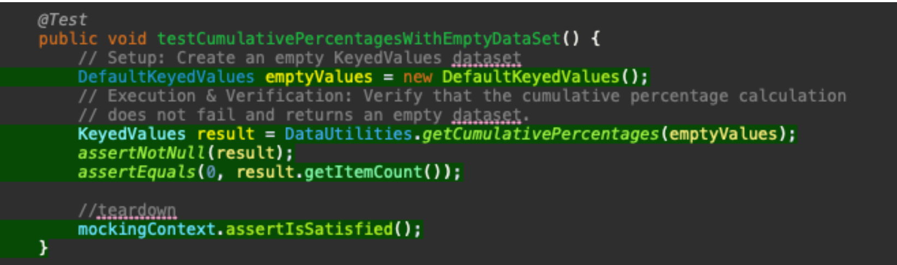
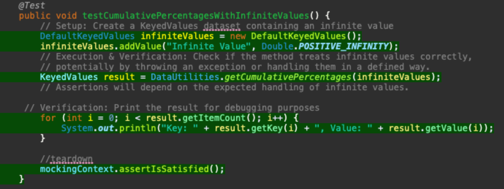
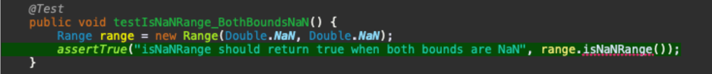
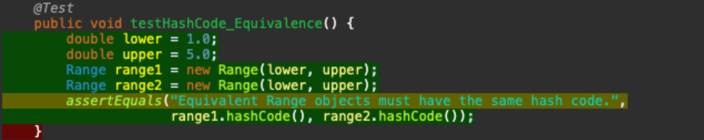
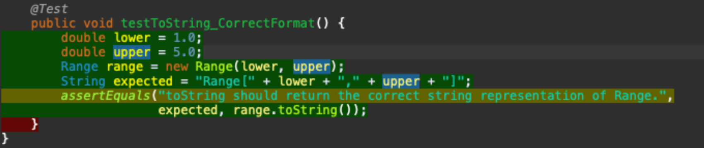

**SENG 637 - Dependability and Reliability of Software Systems**

**Lab. Report #3 – Code Coverage, Adequacy Criteria and Test Case Correlation**

| Group \#: 1    |     
| -------------- | 
| Student Names: |     
| Romil Dhagat   | 
| Yajur Vashisht |    
| Clark Harrison Dy |  
| Nick Nikolov |  
| Yene Irvine | 

(Note that some labs require individual reports while others require one report
for each group. Please see each lab document for details.)

# 1 Introduction

This lab delves into software testing methodologies, focusing on manual data-flow coverage calculations, new unit test strategies, and the creation of impactful test cases. We allocate 15% of our effort to understand two methods, and achieve a 10% increase in code coverage through five selected test cases. Our report includes detailed coverage analysis and evaluates the pros and cons of coverage tools used. We also compare requirements-based and coverage-based test generation. Additionally, we discuss team management, challenges faced, and lessons learned, ending with feedback on the assignment.

# 2 Manual data-flow coverage calculations for X and Y methods

### Data Flow Graph for the method DataUtilities.calculateColumnTotal

DU Pairs per variable:
For total: (2, 7), (2, 11) (2, 12)
For rowCount: (3, 4), (3, 8)
For r2: (4, 4)
For r2: (8, 8)	
For n: (5, 6) (5, 7) (9, 10) (9, 11)

DU-Pair Sets:
du(2, 7, total) = {[2,3,4,5,6,7]}
du(2, 11, total) = {[2,3,4,5,6,7,8,9,10,11], [2,3,4,8,9,10,11]}
du(2, 12, total) = {[2,3,4,5,6,7,8,9,10,11,12], [2,3,4,8,9,10,11,12], [2,3,4,8,12], [2,3,4,5,6,7,8,12]}
du(3,4,rowCount) = {[3, 4]}
du(3,8,rowCount) = {[3, 4, 8], [3, 4, 5, 6, 7, 8]}
du(5,6,n) = {[5,6]}
du(5,7,n) = {[5,6,7]}
du(9,10,n) = {[9,10]}
du(9,11,n) = {[9,10,11]}

For each test case in DataUtilitiesTest, show which pairs are covered:
calculateColumnTotaWithNegativeValues(): 
For n: (9, 10) (9, 11)
For r2: (4, 4)
For r2: (8, 8)
For total: (2, 11) (2, 12)
For rowCount: (3, 4), (3, 8)
calculateColumnTotalWithPositiveValues():
For n: (5, 6) (5, 7)
For r2: (4, 4)
For r2: (8, 8)
For total: (2, 7) (2, 12)
For rowCount: (3, 4), (3, 8)
calculateColumnTotalWithAllZeroValues():
For n: (5, 6) (5, 7)
For r2: (4, 4)
For r2: (8, 8)
For total: (2, 7) (2, 12)
For rowCount: (3, 4), (3, 8)
calculateColumnTotalWithMixedValues():
For n: (5, 6) (5, 7)
For r2: (4, 4)
For r2: (8, 8)
For total: (2, 7) (2, 12)
For rowCount: (3, 4), (3, 8)
calculateColumnTotalWithNullValues():
For n: (5, 6) (5,7)
For r2: (4, 4)
For r2: (8, 8)
For total: (2, 7) (2, 12)
For rowCount: (3, 4), (3, 8)
calculateColumnTotalWithEmptyData():
For r2: (4, 4)
For r2: (8, 8)
For total: (2, 12)
For rowCount: (3, 4), (3, 8)

DU-pair coverage calculation:
There are 11 pairs, of which, all 11 pairs are covered (as listed above). Therefore, we have a coverage of 100% (11 / 11 * 100%)

### Data Flow Graph for the method Range.constrain

DU Pairs per variable:
For result: (1, 7) (6,7) (4,7)

DU-Pair Sets:
du(1,7,result) = {[1, 2, 7], [1, 2, 3, 4, 7], [1, 2, 3, 5, 6, 7], [1, 2, 3, 5, 7]}
du(6, 7, result) = {[6, 7]}
du(4, 7, result) = {[4, 7]}

For each test case in RangeTest, show which pairs are covered:
testConstrain_ValueWithinRange():
For result: (1, 7)
testConstrain_ValueBelowRange():
For result: (1, 7), (6, 7)
testConstrain_ValueAboveRange():
For result: (1, 7), (4, 7)

DU-pair coverage calculation:
There are 3 pairs, of which, all 3 pairs are also covered (as listed above). Therefore, we have a coverage of 100% (3 / 3 * 100%)

# 3 A detailed description of the testing strategy for the new unit test

Analyze Current Coverage

We will use EclEmma to run the existing test suite and determine the current code coverage levels. This analysis will reveal which methods, branches, and statements are not covered by the current tests.

Identify Coverage Gaps

After reviewing the EclEmma coverage report, we will identify which parts of the DataUtilities and Range classes have insufficient coverage. The gaps may include:

Unexecuted branches within conditional statements.
Uninvoked methods.
Exception handling code that hasn't been triggered.
Prioritize Test Case Development

We will prioritize new test cases based on:
Risk - More critical code paths that are uncovered will receive higher priority.
Complexity - Complex conditional logic that isn't fully tested will be targeted for additional tests.
Feasibility - Some paths may be infeasible to test due to limitations within the test environment or because they are theoretically unreachable.

Design New Test Cases

For each identified coverage gap, we will design new test cases that:
Target Uncovered Branches - For every if/else and switch/case statement, ensure both the true and false cases are tested, along with each case block.
Exercise Exception Handling - For try/catch blocks, create tests that induce exceptions to ensure exception handling is tested.
Cover Edge Cases - Identify boundary values and edge cases for each method, ensuring they are included in the test inputs.
Test State Changes - For methods that alter the state of an object, ensure state changes are asserted correctly.

Implement Test Cases

Tests will be implemented following best practices:
Clarity - Each test should be clearly named to reflect its purpose and should include comments explaining its role in increasing coverage.
Independence - Tests should be designed to run independently of one another and should not assume any particular order of execution.
Assert Correct Behavior - Tests should include assertions that compare the actual outcomes with expected outcomes, based on the behavior described in the Javadocs.

# 4 A high level description of five selected test cases you have designed using coverage information, and how they have increased code coverage

# 5 A detailed report of the coverage achieved of each class and method (a screen shot from the code cover results in green and red color would suffice)

# 6 Pros and Cons of coverage tools used and Metrics you report

Team 1’s experience with EclEmma was generally positive, especially due to the seamless integration within Eclipse that helped us with real-time coverage analysis. This integration allowed for immediate feedback within our development environment, while editing various tests and enhancing our workflow. However, EclEmma's limitation to statement and branch coverage meant that we did not have direct insight into condition coverage, requiring us to infer this information indirectly or supplement with manual analysis. Although the tool was stable and user-friendly, there were occasional glitches when interfacing with other Eclipse plugins, necessitating occasional workarounds. Updating it also caused a few issues within the Eclipse marketplace. 

# 7 A comparison on the advantages and disadvantages of requirements-based test generation and coverage-based test generation.

Requirements-based testing, defined by predefined criteria, ensures that all functionalities are verified, promoting alignment with the needs and specifications of the product. It can miss edge cases not outlined in the requirements. Whereas, coverage-based testing excels at uncovering hidden defects by incentivizing thorough exploration of the codebase. However, it may promote a quantity-over-quality approach to test cases, potentially neglecting the actual usability that requirement based testing captures. The insights gained from coverage tools are useful, but they require careful interpretation to avoid overfitting tests to the implementation. Both of them in conjunction would provide someone testing software with comprehensive, robust testing.

# 8 A discussion on how the team work/effort was divided and managed

Our team effectively partitioned tasks according to individual strengths, and then used a buddy system to verify the work performed. This streamlined our testing process and maximized our coverage efficiency. 

# 9 Any difficulties encountered, challenges overcome, and lessons learned from performing the lab

One significant challenge was differentiating between meaningful test coverage and superficial test quantity, which reinforced the value of strategic test design over mere coverage metrics. Especially because EclEmma has different ‘criteria’ than the ones listed in our rubric. 

# 10 Comments/feedback on the lab itself

The assignment was a practical exercise in applying coverage tools, though a greater focus on condition coverage techniques would have enhanced our testing acumen. Also comparing them with manual testing techniques in this assignment would have been helpful.
